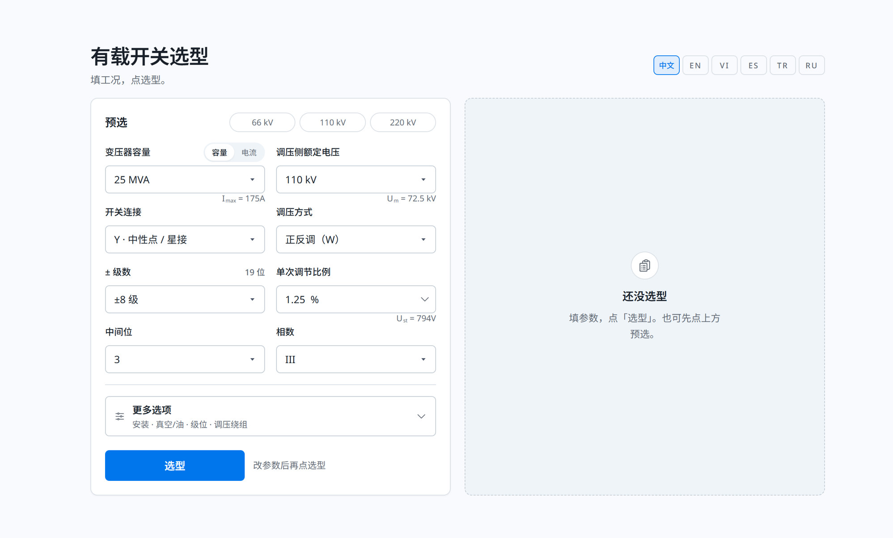

# 有载开关选型

填工况，点选型。给出目录里**最低满足**的型号。价格只给内部登录后看。

**在线：** [oltc-selector.vercel.app](https://oltc-selector.vercel.app/) · [GitHub Pages](https://erict16.github.io/oltc-selector/)



私人辅助，不是厂家官网。型号是起点，出 OS 前要工程确认。

## 怎么用

预选 66 / 110 / 220 kV 会带上常用工况。默认填变压器容量，星接/角接推出最大通过电流 Iₘₐₓ（含最低分接和安全系数）。调压侧电压推出开关 Uₘ；每级 % 推出 Uₛₜ。点选型之后才出型号，改参数要再点一次。

引擎按 2025 目录排：**CV2 → CM2 → SHZV → SHZVG**。能用一台三相就不拆成三台单相。没有 CV2-500。箱顶走 HWV；更多选项里可切无载（WSL / WSG）、油灭弧、安全系数。

```bash
npm install
npm run dev      # http://127.0.0.1:3000
npm test
npm run build
```

GitHub Pages：`npm run build:gh`（`GH_PAGES=true`，路径 `/oltc-selector/`）。Vercel 根路径，不要设 `GH_PAGES`。

内部看价：右上角「内部」，口令。本地 `.env.local`：

```
NEXT_PUBLIC_ADMIN_PASSWORD_SHA256=<sha256 hex of the password>
```

GitHub Actions 用 secret `ADMIN_PASSWORD` 在构建时哈希。Vercel 用同一个 `NEXT_PUBLIC_ADMIN_PASSWORD_SHA256`。没配口令则登不进去，公开页仍然能选型、没有价格。

语言：中文、English、Tiếng Việt、Español、Türkçe、Русский。

## 测试

`npm test`：引擎、2025 价目、真实报价回放。笔记在 `docs/replay/`。

## 许可

[条款](https://erict16.github.io/oltc-selector/terms/) · [隐私](https://erict16.github.io/oltc-selector/privacy/)。仅供参考。
